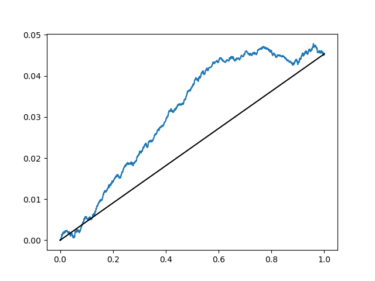
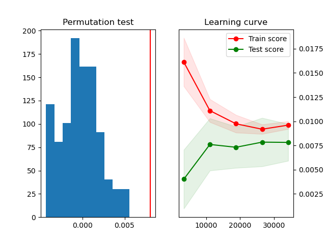

# uplift-sklearn

### Uplift modeling package based on and integrated with `scikit-learn`.

### Authors: Szymon Jaroszewicz, Krzysztof Rudaś


## Design goals

The design goal of `uplift-sklearn` is to seamlessly integrate with `scikit-learn` and follow its conventions as closely as possible.  It is possible to use model evaluation and tuning facilities from `scikit-learn` either directly or as thin wrappers provided by `uplift-sklearn`.


## Features

* A comprehensive collection of datasets for uplift modeling (we believe this is the most complete collection of randomized datasets)
  * marketing and advertising datasets
  * medical RTC datasets
* Tight integration with scikit-learn: model evaluation routines can be used just as in scikit-learn
* Meta-models: T/S/X Learners, transformed target learner

## Getting started

To install `uplift-sklearn` simply use

``` shell
pip install uplift-sklearn
```
or to get the latest version install directly from Github
``` shell
pip install git+https://github.com/jszymon/uplift-sklearn
```

Let us now build an uplift model on the well known Hillstrom dataset.  Begin with the necessary imports:

``` Python
import numpy as np
from sklearn.model_selection import train_test_split
from sklearn.preprocessing import OneHotEncoder
from sklearn.preprocessing import StandardScaler
from sklearn.compose import ColumnTransformer
from sklearn.linear_model import LogisticRegression
```

Now fetch the dataset and do basic preprocessing

``` Python
from usklearn.datasets import fetch_Hillstrom
D = fetch_Hillstrom(as_frame=True)
trt = D.treatment
# encode categorical features, standardize numerical features
ct = ColumnTransformer([("ohe", OneHotEncoder(), list(D.categ_values.keys()))],
                       remainder=StandardScaler())
X = ct.fit_transform(D.data)
# keep only women's campaign
mask = ~(trt == 1)
X = X[mask]
y = D.target_visit[mask]
trt = (trt[mask] == 2)*1
```

By `uplift-sklearn` convention, treatments are denoted by successive integers with 0 indicating controls. Addtionally the special `n_trt` argument is passed to all methods to indicate the number of treatments (if `n_trt` is `None` it will be inferred automatically, but this may be unreliable and is discouraged).

Now, we're ready to fit an uplift model (TLearner in our case)

``` Python
X_train, X_test, y_train, y_test, trt_train, trt_test = train_test_split(X, y, trt, train_size=0.7)
m = TLearnerUpliftClassifier(base_estimator=LogisticRegression())
m.fit(X_train, y_train, trt_train, n_trt=1)
```

and draw an uplift curve

``` Python
import matplotlib.pyplot as plt
from usklearn.metrics import uplift_curve, area_under_uplift_curve

score = m.predict(X_test)[:,1]
print("AUUC=", area_under_uplift_curve(y_test, score, trt_test, n_trt=1))
cx, cy = uplift_curve(y_test, score, trt_test, n_trt=1)
plt.plot(cx, cy)
plt.plot([0,1], [0,cy[-1]], "k-")
plt.show()
```



One can use `cross_val_score` and `GridSearchCV` to easily evaluate
models or tune their parameters, just as one does in `scikit-learn`.
The functions provided by `uplift-sklearn` are thin wrappers of
original `scikit-learn` functions so they behave exactly the same as
they would for standard classifiers.

``` Python
# import those from usklearn instead of sklearn
from usklearn.model_selection import cross_val_score
from usklearn.model_selection import GridSearchCV

m1 = TLearnerUpliftClassifier(base_estimator=LogisticRegression())
m_cv1 = GridSearchCV(m1,
                     {"base_estimator__C":[1e-1,1,1e1,1e2,1e3]},
                     cv=3, n_jobs=-1)
# tune regularization of treatment/control models separately
m2 = TLearnerUpliftClassifier(base_estimator=[("model_c", LogisticRegression()),
                                              ("model_t", LogisticRegression())])
m_cv2 = GridSearchCV(m2,
                    {"model_c__C":[1e-1,1,1e1,1e2,1e3],
                    "model_t__C":[1e-1,1,1e1,1e2,1e3]},
                    cv=3, n_jobs=-1)
```
Now evaluate both models using crossvalidated Area Under Uplift Curve

``` Python
auuc_m1 = np.mean(cross_val_score(m_cv1, X, y, trt, n_trt=1, cv=5, scoring="auuc"))
auuc_m2 = np.mean(cross_val_score(m_cv2, X, y, trt, n_trt=1, cv=5, scoring="auuc"))
print("crossval AUUC m1:", auuc_m1)
print("crossval AUUC m2:", auuc_m2)
```

Finally, do a permutation test and draw a learning curve.  Again the functions below are thin wrappers of original `scikit-learn` functions so they accept the same set of parameters.

``` Python
from usklearn.model_selection import permutation_test_score, learning_curve

score, permutation_scores, pv =\
    permutation_test_score(m, X, y, trt, n_trt=1, cv=3,
                           n_permutations=100, scoring="auuc",
                           verbose=10, n_jobs=-1)

fix, (ax0, ax1) = plt.subplots(ncols=2)
ax0.hist(permutation_scores, density=True, label=f"p-value={pv}")
ax0.axvline(score, color="r")
ax0.set_title("Permutation test")

train_sizes, train_scores, test_scores = learning_curve(m, X, y, trt, n_trt=1, scoring="auuc")

train_scores_mean = train_scores.mean(axis=1)
train_scores_std = train_scores.std(axis=1)
test_scores_mean = test_scores.mean(axis=1)
test_scores_std = test_scores.std(axis=1)
ax1.fill_between(train_sizes,
                 train_scores_mean - train_scores_std,
                 train_scores_mean + train_scores_std,
                 alpha=0.1, color='r')
ax1.plot(train_sizes, train_scores_mean, 'ro-', label="Train score")
ax1.fill_between(train_sizes,
                 test_scores_mean - test_scores_std,
                 test_scores_mean + test_scores_std,
                 alpha=0.1, color='g')
ax1.plot(train_sizes, test_scores_mean, 'go-', label="Test score")
ax1.legend()
ax1.yaxis.tick_right()
ax1.set_title("Learning curve")
plt.show()
```



We can see that the model is significantly better than random guessing and optimal performance seems to be achieved aleady with 10000 training records.


## Documenation

TODO
